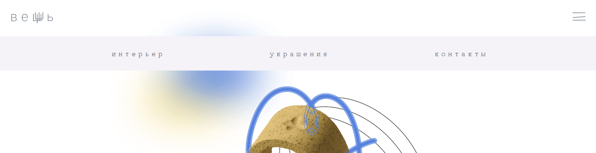

# __Проект: Вещь__

Проект сайта для бренда керамических изделий "Вещь".

## Обзор

*"Вещь - это авторская керамика для интерьера, для быта, для себя."*

**[Ссылка на сайт](https://veshch.vercel.app/)**

__Сайт имеет три раздела:__

* главная страница
* интерьерная керамика:

* аксессуары:

Навигация по сайту осуществляется с помощью соответствующего подраздела на главной странице:

Также на сервисе реализовано бургер-меню, закрепленное в верхней части окна просмотра:

Закрыть меню навигации можно по нажатию кнопки Esc или по клику за его пределами.

Для удобства пользователей внизу всех разделов есть кнопка "наверх":

Все интерактивные элементы анимированы.

Благодаря использованию технологий Grid Layout, flexbox, а также применению медиазапросов, сайт корректно подстраивается под различные разрешения экрана:

 

## Планы по модернизации
В будущем планируется доработка мобильной версии сайта

## Стек технологий

   

* HTML
* CSS
* JavaScript
* React

## __Владелец бренда и автор макета__

 https://www.instagram.com/veshch_shch \
 https://t.me/julia_shchu

## __Связаться со мной__

 sashakostiukova@yandex.ru \
 https://t.me/a_kostiukova